# Setup HDB Resale Data into Supabase

## Account Creation
- Create a free account if you have not already done so.
- First, enter a project name
- Next, enter a database password, please copy the password and place it some where safe. Click `Create new project` when done.

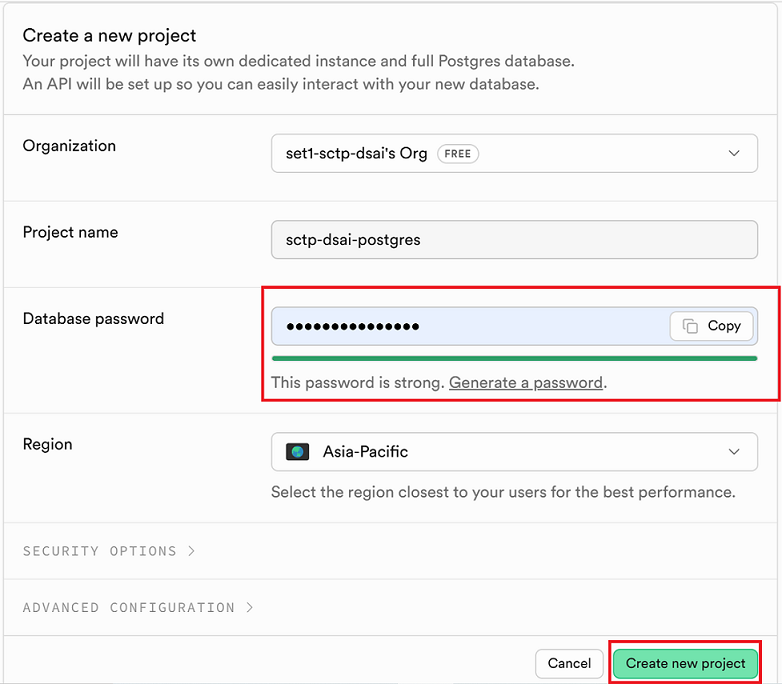


## Preparing Data File
- you can use the old data file from lesson 2.6 [data folder](https://github.com/thomastay353/5m-data-2.6-data-pipelines-orchestration/tree/main/data) 
- File name is `ResaleflatpricesbasedonregistrationdatefromJan2017onwards.csv`
- Alternatively you can get data from [https://data.gov.sg/](https://data.gov.sg/) at
- https://data.gov.sg/datasets?query=HDB+resale&resultId=d_8b84c4ee58e3cfc0ece0d773c8ca6abc

## Importing CSV to Supabase
- Create a table under table editor but do not enter anything yet.

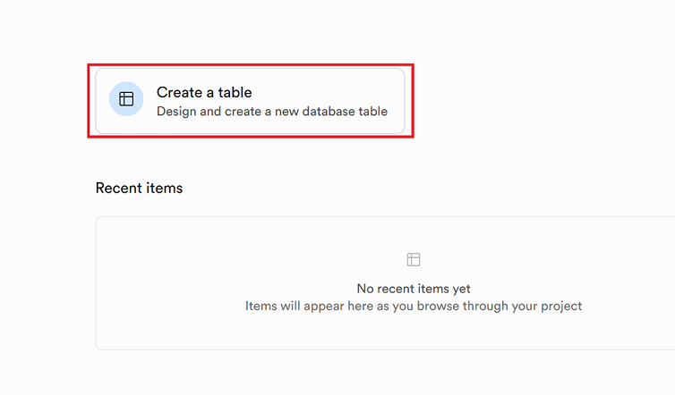

- Enter the table name as shown: `hdb_resale_flat_prices_e2e`

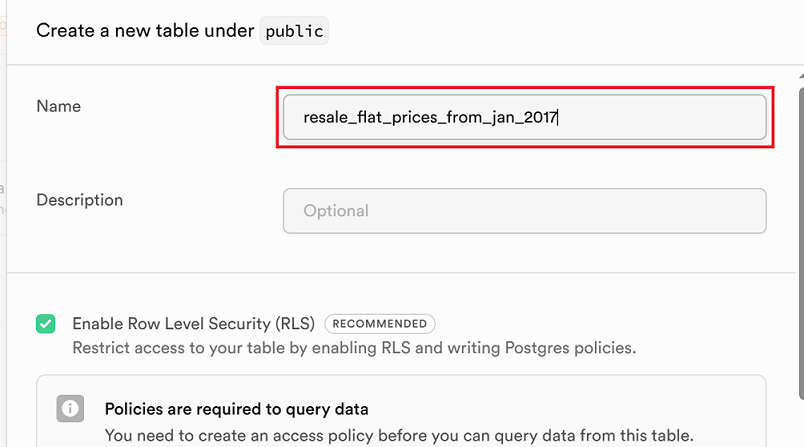

- Click `Import Data from CSV`

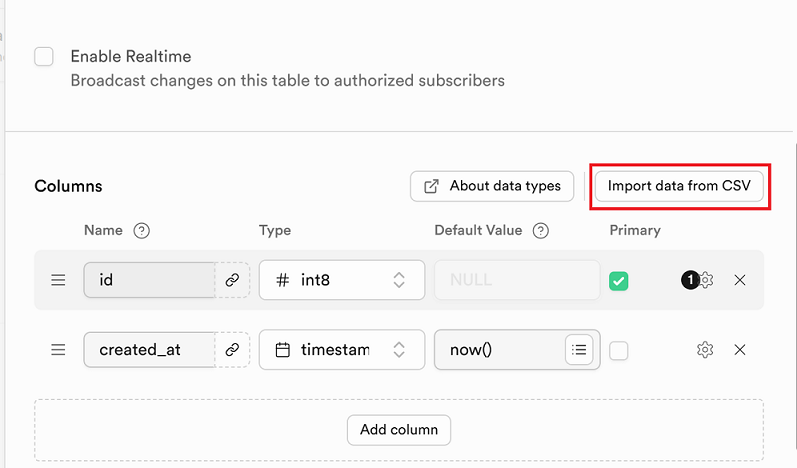

- Click `browse` (some classmate got issue with drag and drop)

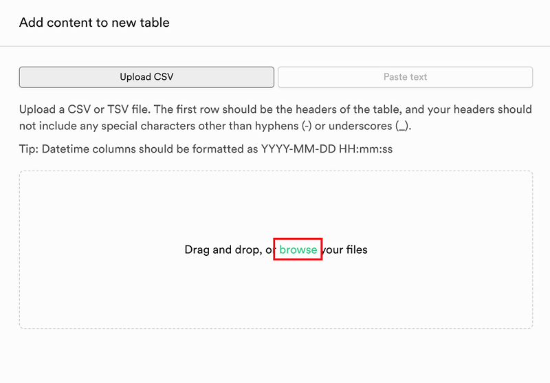

- Once your file is loaded, you should see something like below, click `Save` to import:

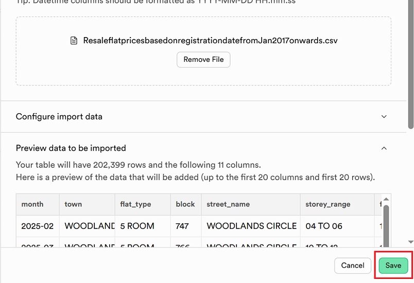

- Click `Save` again

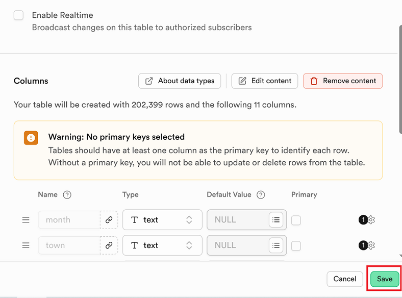


- You should see the import progress as shown below, this will take a while:

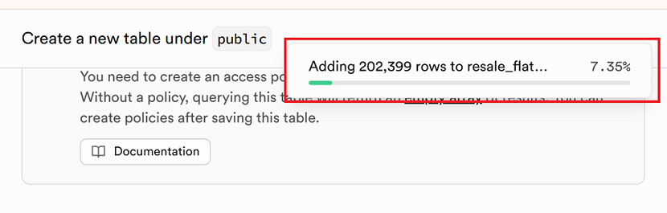

### Create primary key

Primary key has been created if you use the split data in the subfolder `split`.

If you upload the original csv, you need to create the primary key as shown below:

Primary key has been created in the data split program.

- Once it is done, we need to add primary key, click insert and select columns

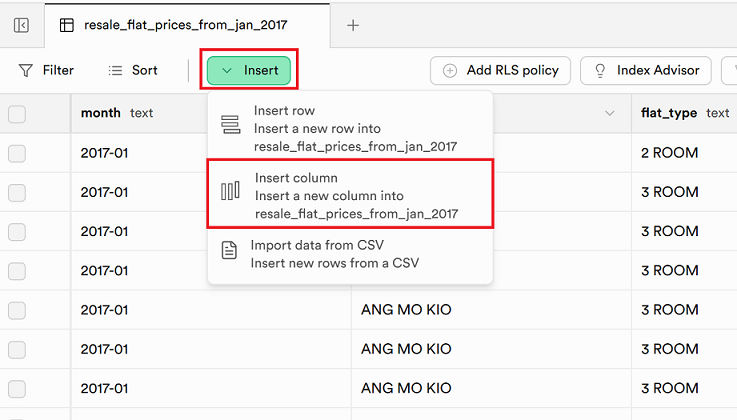

- Set the id, type and identity

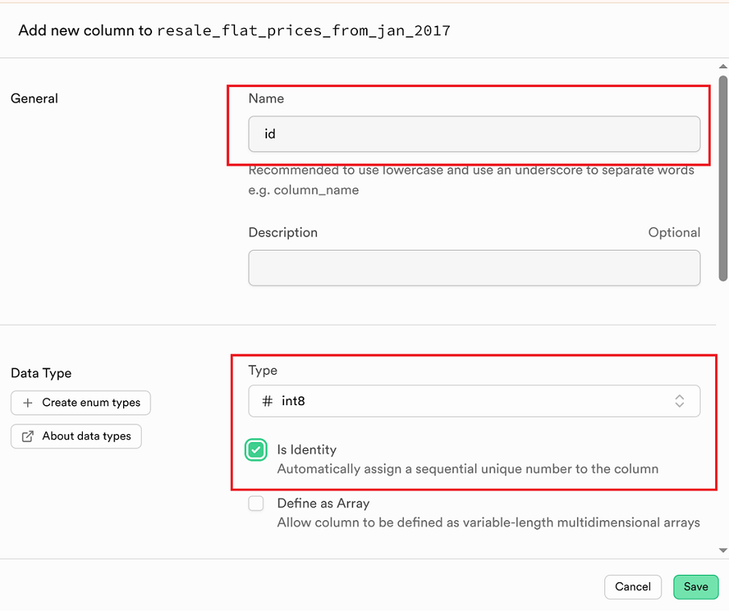

- Follow the checks below and click save:

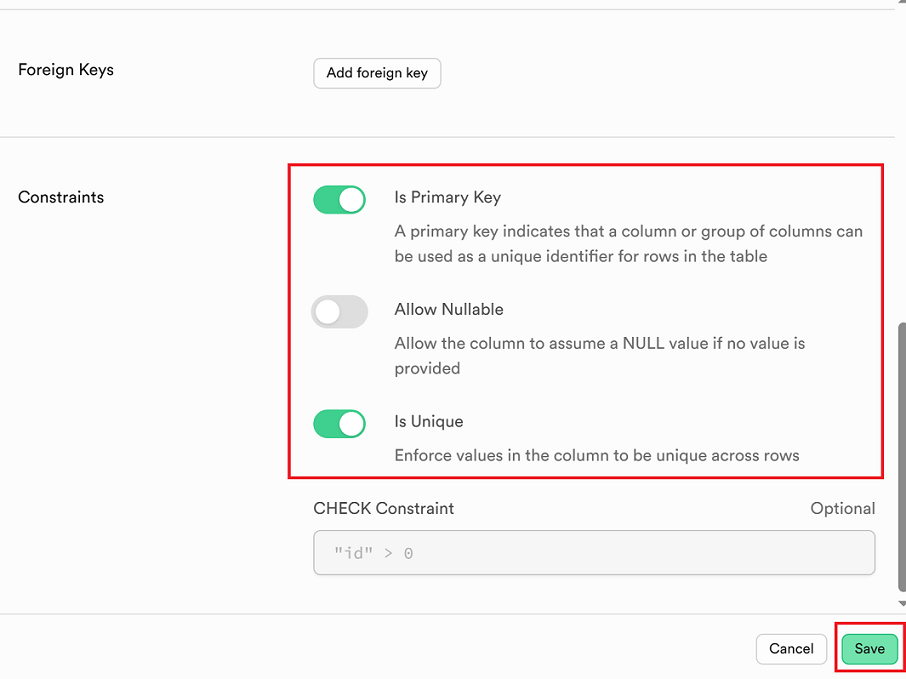

- We should have the result below:

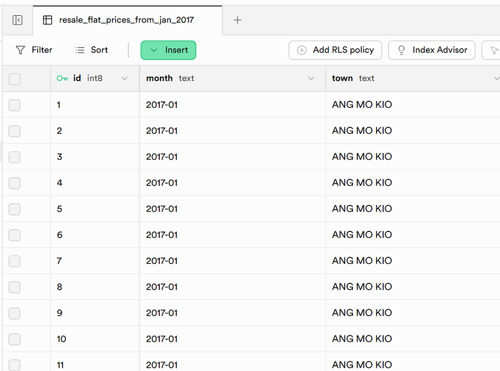

### Setting up Timestamp Tracking

Please only run the following SQl script ONCE:

```sql
-- 1. Add the missing tracking columns to your existing table safely
ALTER TABLE hdb_resale_flat_prices_e2e 
ADD COLUMN IF NOT EXISTS created_at TIMESTAMP WITH TIME ZONE DEFAULT NOW(),
ADD COLUMN IF NOT EXISTS updated_at TIMESTAMP WITH TIME ZONE DEFAULT NOW();

-- 2. Create the strict timestamp tracking function
CREATE OR REPLACE FUNCTION strict_timestamp_tracker()
RETURNS TRIGGER AS $$
BEGIN
    -- If a row is being updated, force created_at to stay exactly what it was
    IF (TG_OP = 'UPDATE') THEN
        NEW.created_at = OLD.created_at;
    END IF;
    
    -- Force updated_at to refresh to the exact current time
    NEW.updated_at = NOW();
    RETURN NEW;
END;
$$ LANGUAGE plpgsql;

-- 3. Drop the trigger if it already exists (prevents duplication errors)
DROP TRIGGER IF EXISTS enforce_strict_timestamps ON hdb_resale_flat_prices_e2e;

-- 4. Attach the trigger to your existing table
CREATE TRIGGER enforce_strict_timestamps
BEFORE UPDATE ON hdb_resale_flat_prices_e2e
FOR EACH ROW
EXECUTE FUNCTION strict_timestamp_tracker();
```

## Connection with Supabase
To get the connection setting from Supabase, please follow the steps below:

- Click connect
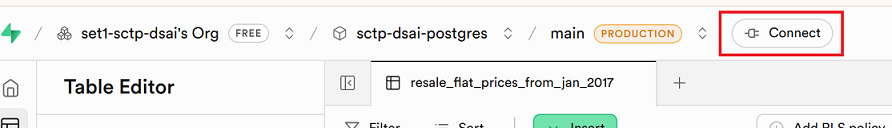

- Change connection method from `Direct connection` and to `Session pooler`
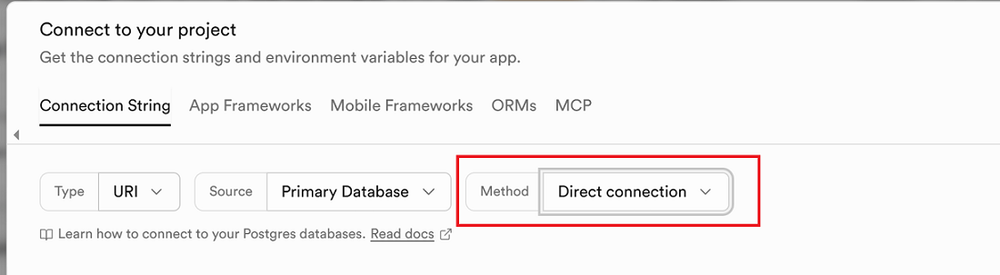
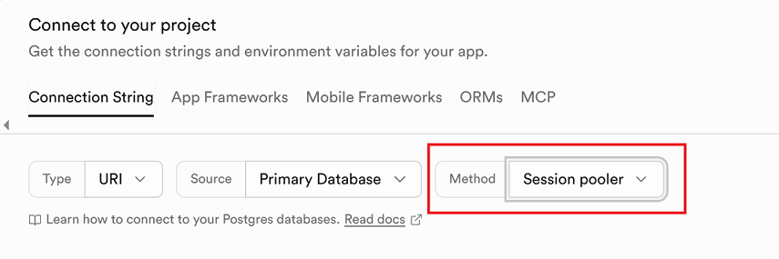

### Connection Type
- For connection type, we use the default `URI` , the setting should be similar across different type. 
- If you want to test your connection in Python, you can select `Python` or `SQLAlchemy`
- If you select Python or SQL Alchemy, additional Python code will be provided for us to test the connection. 

### Connection Method 
- This is related to your specific ISP. In Singapore, we stick to `Session pooler`. This is for ISP who uses IPv4.
- If you encounter error with `Session pooler`, and you know that your ISP uses only IPv6, then you can try `Direct connection`.

### Get Connection Parameters - Session pooler
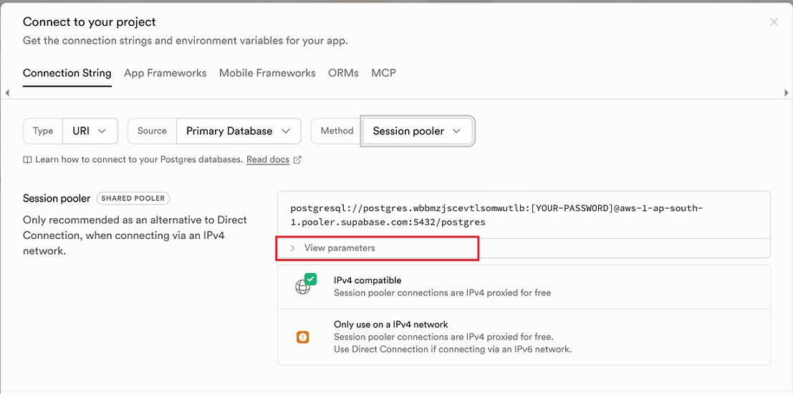
- Click `View parameters`
- The settings that is related to your database will be presented to you.

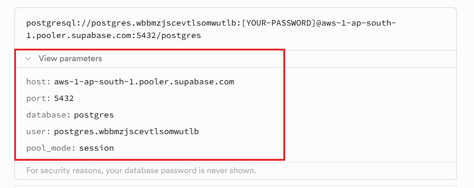
- **Take note of the parameters as we need it to configure Meltano. Please note that we also need to have the db password we created on the first step.**

### Testing Connection
If you encounter connection issues with Meltano, you can try choosing Python or SQLAlchemy. Next to the connection string, the code to test the connection is provided.

### Possible Connection Error
Supabase, uses IPV6 for direct connection, so the problem may depend on your ISP. Anyway, the following warning is shown:
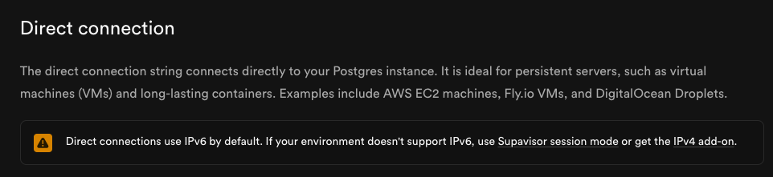

- Try `Session pooler` first and if error try `Direct connection`.

Reference link: https://supabase.com/docs/guides/database/connecting-to-postgres
